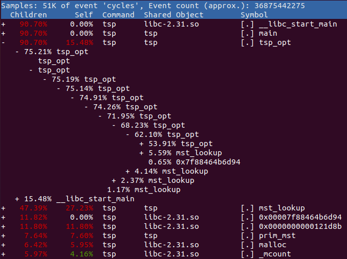

# Assignment P3 – Traveling Salesman Problem (TSP) Optimization
### Bug Lee (7225881)


## Overview
This project focuses on optimizing small-scale TSP (n=30). Despite the small size, naive solution using brute force become intractable, estimated to take more than billions of years of computation time. Therefore, the following optimizations were used to tackle the TSP. 
-  High level optimization was applied reduce the growth rate from factorial to exponential. Approximation algorithm based on prim's algorithm and software caching reduced runtime complexity from O(n!) to O($n^2 2^n$). This techniques were introduced in Writing Efficient Programs by Jon Bently [1]. To avoid blindly using the algorithm without understanding, deeper analysis on the algorithms were performed in this report. 
-  Multi-threading using OpenMP was explored for constant factors of speed up.
-  Low level optimization was applied for noticiable speed up. Converted Array of Structure (AoS) to Structure of Array (SoA) for better hardware cache performance. 

In the end, small-scale TSP with input size 30 was solved in less than 100 seconds.


## Set up

All measurements were performed using the personal laptop. The specification of the laptop is:
- Architecture: x86-64
- Logical CPU threads: 8
- Model: 11th Gen Intel(R) Core(TM) i5-1135G7 @ 2.40GHz
- L1d cache: 192 KiB
- L1i cache: 128 KiB
- L2 cache: 5 MiB
- L3 cache: 8 MiB
- RAM: 16 GB
- OS: Ubuntu 20.04 LTS 

The naive implementation and all optimizations are written in C++ and compiled with g++ compiler version 9.4.0. O3 compiler optimization flag was used for all implementation. Parallelism was implemented using OpenMP version 4.5. 

The number of input cities ranged from 8 to 30. The location of each city was set to have a random x-coordinate between 0 to 500 and a random y-coordinate between 0 to 500. Random seed 0 was used to produce deterministic output.

The Optimizations were applied incrementally in order, whereas later optimization implicitly uses all earlier optimizations. 

## Naive implementation
The naive approach set the baseline performance of the algorithm. The naive solution is to try all permutations of visiting n cities in order, then select the ordering that gives the optimal result. 

```c++
void tsp_unopt (vector<City> cities, float curr_total)
{
  int size = cities.size ();
  // base case: no more cities to visit
  if (size == 0)
  {
    // connect first and last cities to form cycle
    float total_dist = dist (visited[0], visited[visited.size ()-1]) + curr_total;
    // update minimum total distance if needed
    if (total_dist < min_total_dist)
    {
      min_total_dist = total_dist;
      for (int i = 0; i < visited.size (); i++)
        tsp_route[i] = visited[i];
    }
    return;
  }

  for (int i = 0; i < size; i++)
  {
    // visit next city
    visited[size-1] = cities[i];
    vector<City> sub_cities (size-1);
    int k = 0;
    // exclude visited city from the cities
    for (int j = 0; j < size; j++)
    {
      if (j == i)
        continue;

      sub_cities[k] = (cities[j]);
      k++;
    }

    tsp_unopt (sub_cities, curr_total + dist (visited[size-1], visited[size]));
  }
}
```

However, the brute force approach requires computing (n-1)!=O(n!) different ordering of cities, where search space become intractable even for the small graph.

### Result
Results after input size 13 were estimated based on the growth pattern.

| Size | Time (Seconds) | Tour cost |
| :--: | :--: | :--: |
| 8 | 0.000 | 1329.76 | [ 1 3 0 2 5 6 4 7 ]
| 9 | 0.003 | 1471.03 | [ 4 7 1 3 0 2 5 6 8 ]
| 10 | 0.055 | 1483.82 | [ 8 4 7 1 3 0 2 5 6 9 ]
| 11 | 0.323 | 1529.18 | [ 4 8 9 6 5 2 0 3 1 7 10 ]
| 12 | 2.987 | 1529.62 | [ 8 9 6 5 2 0 3 1 7 10 4 11 ]
| 13 | 36.082 | 1531.18 | [ 6 9 8 11 4 10 7 1 3 0 2 5 12 ]
| 14 | ~504 | - |
| 15 | ~7560 | - |
| 16 | ~120960 | - |
| ... | ... | - |
| 30 | Trillions | - |

## Profile #1
Using `perf`, it was observed that most of the computations were spent on recursions (i.e. computing subpaths). Therefore, the first step is to cut down on number of recursions.


## High Level: Approximation algorithm and Caching

### Analysis

The idea here is to safely ignore computing some of the paths that cannot be part of the solution. This can be done by making an approximation for the subpath and comparing with cost of a known path (See the figure below). To do so, the algorithm should never make an over-approximated guess. Over-approximation can result in ignoring the potential solution with minimum tour cost. Therefore, the approximation should be always less than the true cost of the path. For this reason, the cost of the Minimum Spanning Tree (MST) of the path can be used for the approximation.


> Proof: 
We know that TSP finds a tour cycle that visits all vertices. After removing an edge from the TSP cycle, the solution becomes a spanning tree since all vertices are connected without any cycle. From this, we can see that there exists at least one spanning tree that cost less than the TSP tour cycle. Then, the lowest cost spanning tree (i.e. Minimum Spanning Tree) must cost less than the TSP tour cycle. Therefore, we conclude that it is safe to approximate the cost of a path using MST.

Prim's algorithm was used to compute the MST. The main idea behind Prim's algorithm is to find the next unvisited vertex with minimum cost and then visit it. A priority queue is generally needed for managing what vertex should visit next. The time complexity of Prim's algorithm with priority queue is known as $O((n+m)\log n)$ (= $O(n^2 \log n)$ for the complete graph). However, in the case of a complete graph, the next unvisited vertex with minimum cost must be one of the neighbors of the most recently visited vertex. Therefore, a simple scan of neighbors is enough to determine what vertex should be visited next, which can be stored in a variable instead of a queue. This simple modification allows MST to be computed in $O(n^2)$ time. 

Another catch to computing MST is that many paths contain common MST. If two paths contain the same vertices, then the same MST can be constructed (See figure below). So, to avoid recomputing MST for each path, the idea here is to cache the MST after the first encounter. The hash table was used for this purpose where a set of vertices as a key and the corresponding MST cost as a value. 


> Efficiency: For a set of $n$ vertices, there are $2^n$ possible subsets. Therefore, there are at most $2^n$ unique MSTs that need to be computed. Assume that cached MST cost can be obtained in $O(1)$ and we found that approximation algorithm (prim's algorithm in this case) takes $O(n^2)$. Combining the approximation algorithm with caching, the total time complexity of the TSP now reduces to $O(n^2 2^n)$ in the average case.

### Result

| Size | Time (Seconds) | Tour cost |
| :--: | :--: | :--: |
| 10 | 0.003 | 1483.82 | 
| 11 | 0.007 | 1529.18 | 
| 12 | 0.020 | 1529.62 | 
| 13 | 0.017 | 1531.18 | 
| 14 | 0.025 | 1534.50 | 
| 15 | 0.104 | 1646.86 | 
| 16 | 0.065 | 1705.58 | 
| 17 | 0.283 | 1818.18 | 
| 18 | 0.200 | 1828.53 | 
| 19 | 0.126 | 1829.87 | 
| 20 | 0.309 | 1861.09 | 
| 21 | 0.320 | 1865.81 | 
| 22 | 0.572 | 1891.83 | 
| 23 | 1.938 | 1897.69 | 
| 24 | 3.322 | 1946.16 | 
| 25 | 5.874 | 1964.82 | 
| 26 | 102.174 | 2029.42 | 
| 27 | 43.087 | 2083.86 | 
| 28 | 60.268 | 2118.28 | 
| 29 | 52.746 | 2122.19 | 
| 30 | 268.344 | 2216.76 | 

## Profile #2
It was observed that there are still a lot of subpaths to compute. Distributing the workload was chosen to be the next step.



## Multi-threading

The idea here is to distribute the computation of the sub-path to multiple threads. For this reason, exploratory decomposition was used. Starting at the home city, there are $n-1$ sub-path that need to be explored. This naturally leads to partitioning the search space of TSP into $n-1$ parts that can be concurrently executed.


To maximize parallelism, a few adjustments were made to the serial implementation. First, instead of sharing computed MST among all threads, each thread gets assigned its own hash table for storing MST. Unlike serial implementation, now some MSTs get recomputed by multiple threads. Second, the global minimum tour cost is shared among all threads. The global minimum tour cost is accessed in two scenarios. One scenario is when checking whether the sub-path can be pruned. To do so, estimated tour cost (known path cost + approximated subpath cost) must be bigger than the minimum tour cost. Since minimum tour cost only decreases, accessing out-of-date minimum tour cost is still safe from causing false pruning hence do not harm the correctness even without locking. Although it result in a more conservative pruning, avoiding locking contention was observed to be more effective. The other scenario is when the minimum tour cost must be updated. Unlucky scheduling order of concurrent threads can accidentally overwrite the potential minimum tour cost, so read and write must happen atomically. The lock must be used in this case, which can be problematic as the number of thread increase. Finally, a dynamic scheduling policy was used. Due to pruning and caching, the workload of each partition is highly unbalanced, making it a good candidate for dynamic scheduling.

### Result

| Size | 1 threads Time (Seconds) | 4 threads Time (Seconds) |
| :--:  | :--:  | :--: |
| 10 |   0.003 |   0.001 |   
| 11 |   0.007 |   0.003 |   
| 12 |   0.020 |   0.012 |   
| 13 |   0.017 |   0.013 |   
| 14 |   0.025 |   0.010 |   
| 15 |   0.104 |   0.033 |   
| 16 |   0.065 |   0.022 |   
| 17 |   0.283 |   0.107 |   
| 18 |   0.200 |   0.072 |   
| 19 |   0.126 |   0.069 |   
| 20 |   0.309 |   0.166 |   
| 21 |   0.320 |   0.112 |   
| 22 |   0.572 |   0.273 |   
| 23 |   1.938 |   1.031 |   
| 24 |   3.322 |   0.729 |   
| 25 |   5.874 |   1.830 |   
| 26 |   102.174 | 29.317 |   
| 27 |   43.087 |   21.608 |   
| 28 |   60.268 |   34.196 |   
| 29 |   52.746 |  22.761 |  
| 30 |   268.344 |   108.945 | 

Limitation: 
Due to the lock contention for updating the global minimum tour cost and sharing global variables among threads (which lead to cache coherence problem), linear speed up based on number of threads was not observed.


## Profile #3

Using `valgrind --tool=cachegrind`, it was observed that L1 cache miss rate grow as input size increase.
```
...
==19705== Command: ./tsp 1 16
==19705== 
==19705== D   refs:      213,394,016  (136,997,450 rd   + 76,396,566 wr)
==19705== D1  misses:        412,098  (    388,090 rd   +     24,008 wr)
==19705== LLd misses:         20,575  (      8,893 rd   +     11,682 wr)
==19705== D1  miss rate:         0.2% (        0.3%     +        0.0%  )
==19705== LLd miss rate:         0.0% (        0.0%     +        0.0%  )
...

==19707== Command: ./tsp 1 17
...
==19707== 
==19707== D   refs:      1,667,563,083  (1,069,534,853 rd   + 598,028,230 wr)
==19707== D1  misses:        4,192,417  (    4,078,933 rd   +     113,484 wr)
==19707== LLd misses:           50,578  (        8,894 rd   +      41,684 wr)
==19707== D1  miss rate:           0.3% (          0.4%     +         0.0%  )
==19707== LLd miss rate:           0.0% (          0.0%     +         0.0%  )
...

==19746== Command: ./tsp 1 18
...
==19746== 
==19746== D   refs:       4,716,785,644  (3,029,112,081 rd   + 1,687,673,563 wr)
==19746== D1  misses:        18,265,535  (   17,838,307 rd   +       427,228 wr)
==19746== LLd misses:            99,156  (        8,899 rd   +        90,257 wr)
==19746== D1  miss rate:            0.4% (          0.6%     +           0.0%  )
==19746== LLd miss rate:            0.0% (          0.0%     +           0.0%  )
...
```

## Low Level: SoA and hardware Caching
Initially, TSP was implemented using OOP design with AoS. Standard c++ library such as `vector class` was used instead of simple array.
```c++
class City
{
  public:
    int id;
    int x;
    int y;

    City ()
    {
      this->id = -1;
      this->x = 0;
      this->y = 0;
    }
    ...
};

vector<City> cities; 
vector<City> visited;
vector<City> tsp_route;
```

Therefore, the code was converted to use SoA to reduce the number of implicit pointers used in OOP that potentially cause cache misses. 
```c++
int city_id[num_city];
int city_x[MAXNUM_CITY];
int city_y[MAXNUM_CITY];
int visited[MAXNUM_CITY];
int tsp_route[MAXNUM_CITY];
```

### Result

| Size |   AoS Time(Seconds) |  SoA Time (Seconds) |
| :--: |  :--: |  :--: |
| 10 | 0.001 | 0.001 |  
| 11 | 0.003 | 0.002 |   
| 12 | 0.012 | 0.006 |   
| 13 | 0.013 | 0.005 |   
| 14 | 0.010 | 0.005 |   
| 15 | 0.033 | 0.020 |   
| 16 | 0.022 | 0.014 |   
| 17 | 0.107 | 0.055 |   
| 18 | 0.072 | 0.043 |   
| 19 | 0.069 | 0.041 |   
| 20 | 0.166 | 0.096 |   
| 21 | 0.112 | 0.069 |   
| 22 | 0.273 | 0.169 |   
| 23 | 1.031 | 0.577 |   
| 24 | 0.729 | 0.433 |   
| 25 | 1.830 | 1.096 |   
| 26 | 29.317 | 16.477 |
| 27 | 21.608 | 12.449 |   
| 28 | 34.196 | 21.087 |   
| 29 | 22.761 | 13.141 |   
| 30 | 108.945 | 68.273 |  


## References:

[1] J.L. Bentley, Writing Efficient Programs, 1st ed. Prentice-Hall Software Series, 1982.